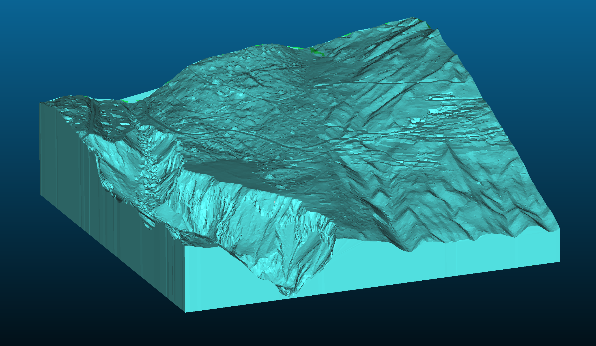
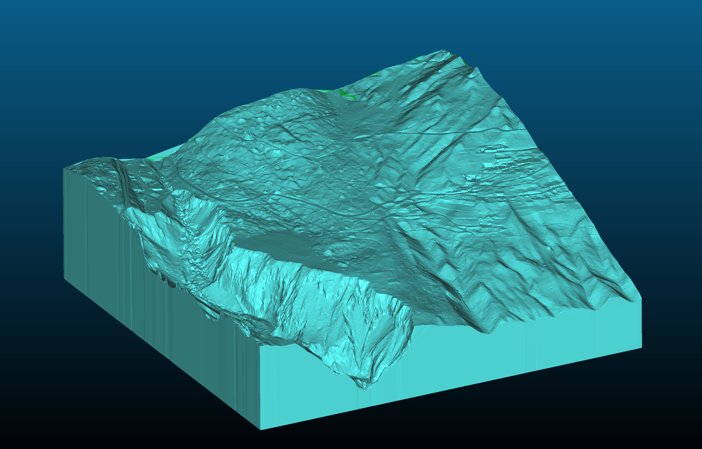
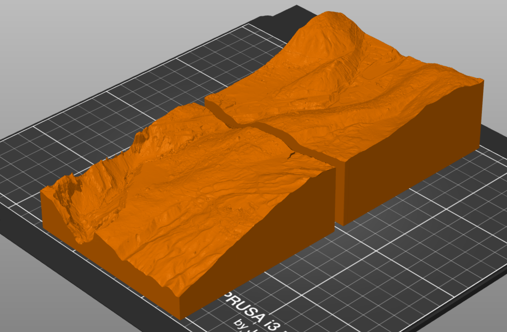
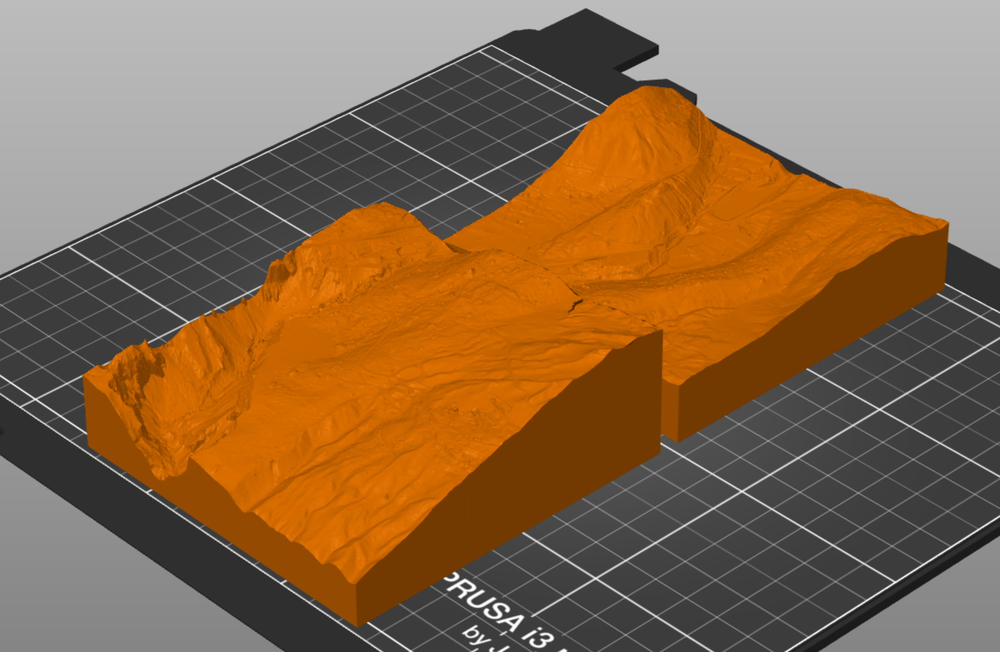

# las2stl

## Requirements

To install the python libraries, run the following:

* Install virtualenv: `python -m pip install --user virtualenv`
* Create virtual env: `virtualenv venv`
* Activate virtual env: `source ./venv/bin/activate`
* Install requirements: `pip install -r requirements.txt`

## Usage

* Place your lidar .las files in the `las` folder.
* Open a command prompt.
* Run `python las2stl.py`.
* The finished mesh is placed in the `stl` folder.

## Configuration

There are some options at the top of the Python script that allow you to tweak
the mesh generation:

### SAMPLE_RATE

Must be between 0.0 and 1.0. Most lidar point clouds are too large to
generate a mesh from. This setting allows you to sample the point cloud. A
value of 0.3 means that 30% of the points are kept, the rest are discarded. A
higher value means more resolution, but also more processing time.

### SCALEXY / SCALEZ
Must be between 0.0 and Infinity. Defines the scaling factor
between the Lidar point cloud and the final mesh. SCALEXY controls the
horizontal scale, SCALEZ controls the height. This allows you to exaggerate the
height of the features. A value of 1.0 means that a cloud of size 1000x1000m is
converted to a mesh of 1000x1000mm. A factor of 0.15 would create a mesh of
size 150x150mm. Note that the scale factor is not mathematically correct, since
many slicers auto-convert meters to millimeters.

### BASE_THICKNESS

Must be greater than 0.0. Minimal thickness in Millimeters of the base the model
stands on.

| BASE_THICKNESS=5 | BASE_THICKNESS=50 |
|---|---|
|  |  |
| 5mm of spacing is added below the lowest point | 50mm of spacing is added below the lowest point |

### BASE_HEIGHT

Can be any number. The altitude in meters above sea level where the final mesh should begin. This should be less than the lowest point in your point cloud.

### COMMON_BASE

True or False. Whether all meshes should begin at the same altitude. Setting it to True makes assembly easier, but might produce lots of unnecessary volume if the tiles include very different altitudes. Setting it to False requires the tiles to be placed on spacers.

If the setting is False, the height of the spacer in Millimeters is printed at the end of the script.

| COMMON_BASE = True | COMMON_BASE = False |
|---|---|
|  |  |
| - | Prints "Spacer height: 0.5mm" and "Spacer height: 20.2mm" |
